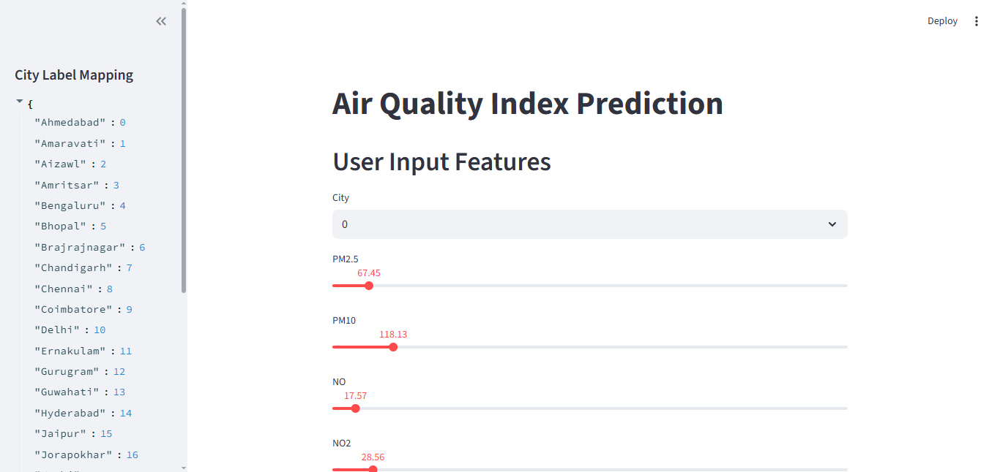
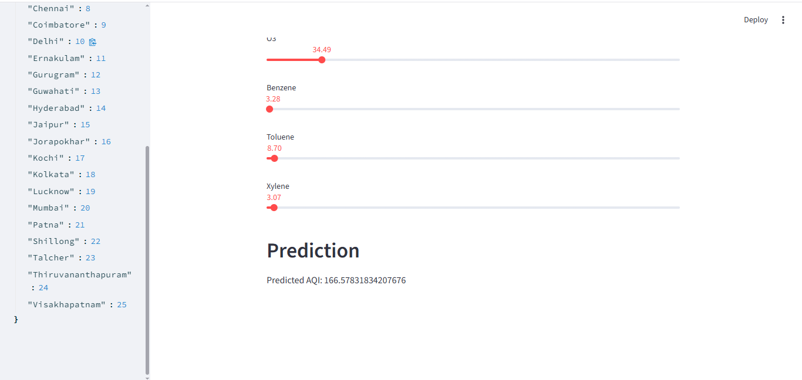

# Air Quality Index (AQI) Prediction

A **Streamlit app** that predicts the **Air Quality Index (AQI)** for major Indian cities using a **Random Forest Regressor** trained on pollution metrics.

---

## Features
- Predict AQI for selected Indian cities.
- Interactive web UI built with Streamlit.
- City label mapping shown in the sidebar.
- Handles missing values (imputed with column means).
- Uses Random Forest Regressor for prediction.

---

## Tech Stack
- **Python 3**
- **Streamlit** – UI
- **pandas / numpy** – data preprocessing
- **scikit-learn** – model training
- **joblib** – optional model persistence

---
##  Screenshots

**Dashboard View:**


**Prediction Example:**


---

##  Project Structure
```
AQI-Prediction/
├─ app.py                # Main Streamlit app
├─ AQIPrediction.ipynb   # Jupyter notebook (EDA + training)
├─ label_encoder.pkl     # Pre-trained LabelEncoder (optional)
├─ city_day.csv          # Dataset
├─ requirements.txt      # Python dependencies
├─ LICENSE               # MIT license
└─ README.md             # Documentation
```

---

##  Installation & Setup

1. Clone the repo  
```
git clone https://github.com/your-username/AQI-Prediction.git
cd AQI-Prediction
```

2. Create a virtual environment  
```
python -m venv venv
# Mac/Linux
source venv/bin/activate
# Windows (cmd)
venv\Scripts\activate.bat
# Windows (PowerShell)
venv\Scripts\Activate.ps1
```

3. Install dependencies  
```
pip install -r requirements.txt
```

4. Run the app  
```
streamlit run app.py
```

---

##  How to Use
1. Select a **city** from the dropdown.  
2. Adjust **pollutant values** (PM2.5, PM10, CO, NO2, etc.) using sliders.  
3. View the **predicted AQI** on the screen.  
4. See the **City Label Mapping** in the sidebar.  

---

##  Dataset
The dataset `city_day.csv` contains daily AQI measurements for Indian cities.  
Columns include: `City`, `PM2.5`, `PM10`, `NO`, `NO2`, `NOx`, `NH3`, `CO`, `SO2`, `O3`, `Benzene`, `Toluene`, `Xylene`, `AQI`.

---

##  Model
- Algorithm: **RandomForestRegressor**  
- Parameters: `max_depth=50, random_state=0`  
- Split: 80/20 train-test  
- Missing values: mean imputation  
- Categorical: Label encoding of city names  

---

##  Future Work
- Save/load trained models with `joblib`.  
- Add AQI trend visualizations.  
- Deploy on **Streamlit Cloud** or **Docker**.  
- Integrate real-time AQI API.  

---

##  Author
**Hardik Sood**  
Mail: hardiksood8@mail.com  
Github: [GitHub](https://github.com/hardiksood1)
