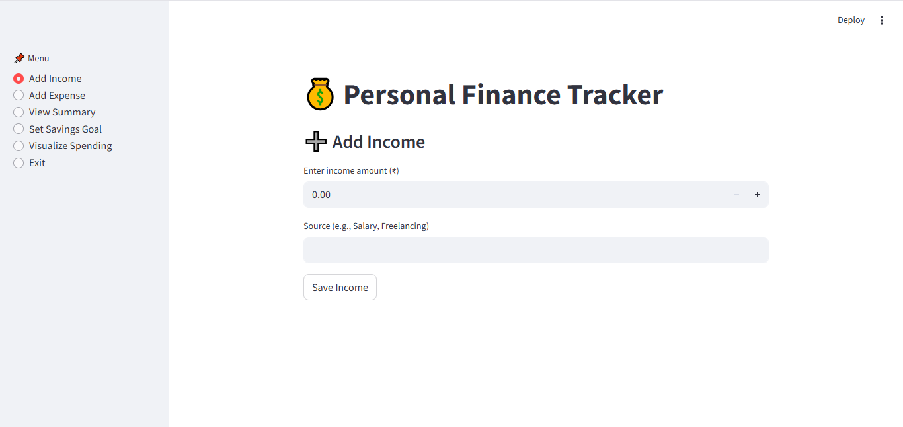
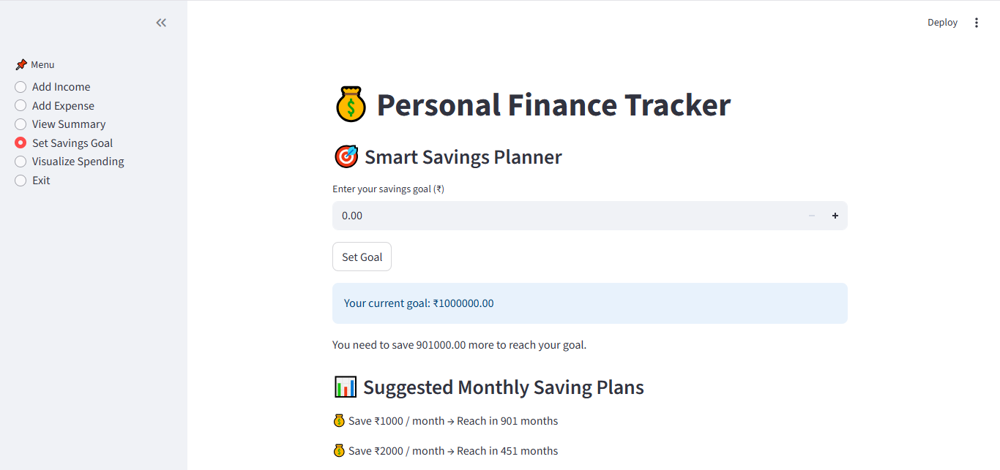
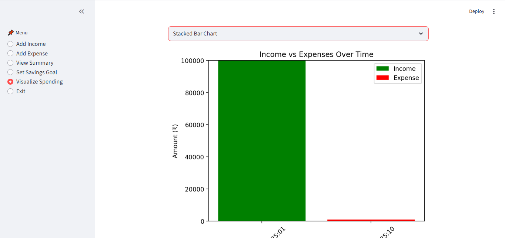
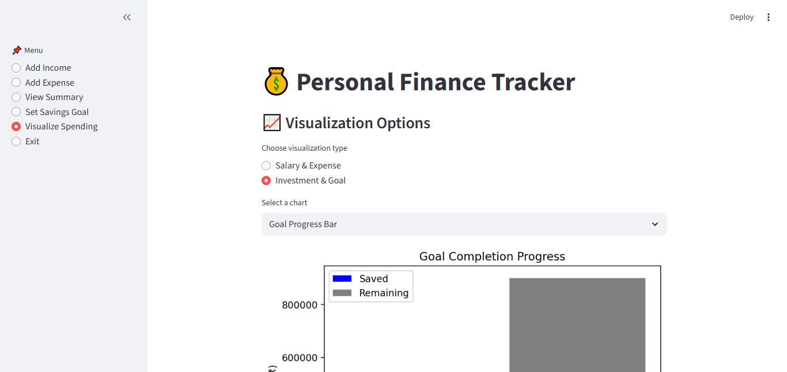

#  Personal Finance Tracker  

A simple yet powerful **Streamlit-based Personal Finance Tracker** that helps you manage **income, expenses, savings goals, and investments** with **interactive visualizations**.  

This app allows you to:  
✅ Add income and expenses  
✅ View real-time financial summary (Income, Expense, Balance)  
✅ Set smart savings goals (like EMI planning)  
✅ Get monthly saving plan suggestions  
✅ Track progress toward financial goals  
✅ Visualize income, expenses, and savings goals with charts  

---

##  Features  

###  Income & Expense Tracking  
- Add income with source (e.g., Salary, Freelancing)  
- Add expenses with categories (e.g., Food, Rent, Travel)  
- Automatic balance calculation  

###  Financial Summary  
- Total Income  
- Total Expenses  
- Remaining Balance  

###  Smart Savings Planner  
- Set a **savings goal** (e.g., ₹50,000)  
- Get **monthly saving suggestions** (₹1000, ₹2000, ₹3000, etc.)  
- Enter **custom months** and calculate required monthly saving (like EMI system)  
- Track real-time progress toward your goal  

###  Visualizations  
1. **Salary & Expense Tracker**  
   -  Bar Chart → Spending by Category  
   -  Pie Chart → Expense Distribution  
   -  Line Chart → Expenses Over Time  
   -  Stacked Bar Chart → Income vs Expenses  
   -  Histogram → Expense Distribution  

2. **Investment & Goal Completion**  
   -  Goal Progress Bar (Saved vs Remaining)  
   -  Goal Completion Pie (Percentage achieved)  

---

## 📸 Screenshots  

### 🏠 Dashboard  
  

### 🎯 Smart Savings Planner  
  

### 📈 Visualizations – Salary & Expense  
  

### 📊 Visualizations – Investment & Goal Completion  
  

---
